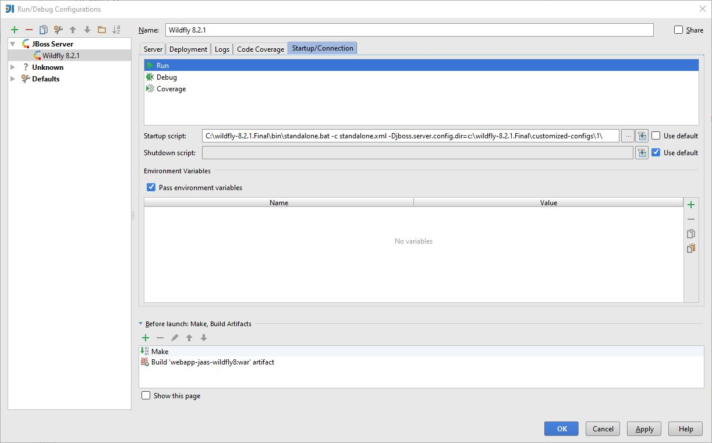

= webapp-security
:revdate: {docdate}
:toc: left
:sectanchors:
:Author: Tibor Digaňa
:numbered:
:star: *

Typical JAAS in web applications.

== Application server on real box

Download the application server

====
[source, text, linenums]
[subs="verbatim,attributes"]
----
$ cd /opt
$ curl http://repo1.maven.org/maven2/org/wildfly/wildfly-dist/8.2.1.Final/wildfly-dist-8.2.1.Final.tar.gz --output wildfly-dist-8.2.1.Final.tar.gz
  % Total    % Received % Xferd  Average Speed   Time    Time     Time  Current
                                 Dload  Upload   Total   Spent    Left  Speed
100  113M  100  113M    0     0   607k      0  0:03:11  0:03:11 --:--:-- 1085k
----
====

and start the server with non-default configuration.

====
[source, shell, linenums]
[subs="verbatim,attributes"]
----
$ tar -xzf wildfly-dist-8.2.1.Final.tar.gz && rm -rf wildfly-dist-8.2.1.Final.tar.gz
$ export WILDFLY_HOME=/opt/wildfly-dist-8.2.1.Final
$ /opt/bin/standalone.bat -c standalone.xml -Djboss.server.config.dir=/opt/wildfly-dist-8.2.1.Final/customized-configs/1/
$ mkdir -p /opt/wildfly-dist-8.2.1.Final/customized-configs/1
$ cp -R /opt/wildfly-dist-8.2.1.Final/standalone/configuration/ /opt/wildfly-dist-8.2.1.Final/customized-configs/1/
----
====

Enable TRACE logs for the security subsystem.

```diff
<subsystem xmlns="urn:jboss:domain:logging:2.0">
	<console-handler name="CONSOLE">
-		<level name="INFO"/>
+		<level name="TRACE"/>
		<formatter>
			<named-formatter name="COLOR-PATTERN"/>
		</formatter>
	</console-handler>
	<periodic-rotating-file-handler name="FILE" autoflush="true">
		<formatter>
			<named-formatter name="PATTERN"/>
		</formatter>
		<file relative-to="jboss.server.log.dir" path="server.log"/>
		<suffix value=".yyyy-MM-dd"/>
		<append value="true"/>
	</periodic-rotating-file-handler>
	<logger category="com.arjuna">
		<level name="WARN"/>
	</logger>
	<logger category="org.apache.tomcat.util.modeler">
		<level name="WARN"/>
	</logger>
	<logger category="org.jboss.as.config">
		<level name="DEBUG"/>
	</logger>
	<logger category="sun.rmi">
		<level name="WARN"/>
	</logger>
	<logger category="jacorb">
		<level name="WARN"/>
	</logger>
	<logger category="jacorb.config">
		<level name="ERROR"/>
	</logger>
+   <logger category="org.jboss.security">
+       <level name="TRACE"/>
+    </logger>
	<root-logger>
		<level name="INFO"/>
		<handlers>
			<handler name="CONSOLE"/>
			<handler name="FILE"/>
		</handlers>
	</root-logger>
	<formatter name="PATTERN">
		<pattern-formatter pattern="%d{yyyy-MM-dd HH:mm:ss,SSS} %-5p [%c] (%t) %s%E%n"/>
	</formatter>
	<formatter name="COLOR-PATTERN">
		<pattern-formatter pattern="%K{level}%d{HH:mm:ss,SSS} %-5p [%c] (%t) %s%E%n"/>
	</formatter>
</subsystem>
```

Add PostgreSQL datasource and remove default H2 datasource.

```diff
<subsystem xmlns="urn:jboss:domain:datasources:2.0">
    <datasources>
-       <datasource jndi-name="java:jboss/datasources/ExampleDS" pool-name="ExampleDS" enabled="true" use-java-context="true">
-           <connection-url>jdbc:h2:mem:test;DB_CLOSE_DELAY=-1;DB_CLOSE_ON_EXIT=FALSE</connection-url>
-           <driver>h2</driver>
-           <security>
-               <user-name>sa</user-name>
-               <password>sa</password>
-           </security>
-       </datasource>
+       <xa-datasource jndi-name="java:jboss/datasources/UserDS" pool-name="UserDS" enabled="true">
+                   <xa-datasource-property name="ServerName">
+               127.0.0.1
+           </xa-datasource-property>
+           <xa-datasource-property name="PortNumber">
+               5432
+           </xa-datasource-property>
+           <xa-datasource-property name="DatabaseName">
+               jaaswf8
+           </xa-datasource-property>
+           <xa-datasource-class>org.postgresql.xa.PGXADataSource</xa-datasource-class>
+           <driver>postgres</driver>
+           <xa-pool>
+               <min-pool-size>1</min-pool-size>
+               <max-pool-size>20</max-pool-size>
+           </xa-pool>
+           <security>
+               <user-name>postgres</user-name>
+               <password>postgres</password>
+           </security>
+           <validation>
+               <valid-connection-checker class-name="org.jboss.jca.adapters.jdbc.extensions.postgres.PostgreSQLValidConnectionChecker"/>
+               <check-valid-connection-sql>select 1</check-valid-connection-sql>
+               <validate-on-match>false</validate-on-match>
+               <background-validation>true</background-validation>
+               <background-validation-millis>25000</background-validation-millis>
+               <exception-sorter class-name="org.jboss.jca.adapters.jdbc.extensions.postgres.PostgreSQLExceptionSorter"/>
+           </validation>
+           <timeout>
+               <idle-timeout-minutes>1</idle-timeout-minutes>
+           </timeout>
+       </xa-datasource>
        <drivers>
-           <driver name="h2" module="com.h2database.h2">
-               <xa-datasource-class>org.h2.jdbcx.JdbcDataSource</xa-datasource-class>
-           </driver>
+           <driver name="postgres" module="org.postgres">
+               <xa-datasource-class>org.postgresql.xa.PGXADataSource</xa-datasource-class>
+           </driver>
        </drivers>
    </datasources>
</subsystem>
```

Remove default datasource of H2 from default bindings.

```diff
- <default-bindings context-service="java:jboss/ee/concurrency/context/default" datasource="java:jboss/datasources/ExampleDS" jms-connection-factory="java:jboss/DefaultJMSConnectionFactory" managed-executor-service="java:jboss/ee/concurrency/executor/default" managed-scheduled-executor-service="java:jboss/ee/concurrency/scheduler/default" managed-thread-factory="java:jboss/ee/concurrency/factory/default"/>
+ <default-bindings context-service="java:jboss/ee/concurrency/context/default" managed-executor-service="java:jboss/ee/concurrency/executor/default" managed-scheduled-executor-service="java:jboss/ee/concurrency/scheduler/default" managed-thread-factory="java:jboss/ee/concurrency/factory/default"/>
```

Add the SQL driver for the PostgresSQL database

.$WILDFLY_HOME/modules/org/postgres/main/module.xml
====
[source, shell, linenums]
[subs="verbatim,attributes"]
----
<?xml version="1.0" ?>

<module xmlns="urn:jboss:module:1.1" name="org.postgres">

    <resources>
        <resource-root path="postgresql-42.2.8.jar"/>
    </resources>

    <dependencies>
        <module name="javax.api"/>
        <module name="javax.transaction.api"/>
    </dependencies>
</module>
----
====

and add the http://repo1.maven.org/maven2/org/postgresql/postgresql/42.2.8/postgresql-42.2.8.jar[driver] to the directory `$WILDFLY_HOME/modules/org/postgres/main/`.

Now run the server

====
[source, shell, linenums]
[subs="verbatim,attributes"]
----
$ $WILDFLY_HOME/bin/standalone.sh -c standalone.xml -Djboss.server.config.dir=/opt/wildfly-dist-8.2.1.Final/customized-configs/1/
----
====

This is the same configuration of Wildfly runtime in IntelliJ IDEA:



== Build docker image and run with external PostgreSQL database

=== Initial setup of PostgreSQL database

If you use a fresh installation of PostgreSQL on a real box, the web application will run properly
but the Docker container will not. You will see the following error:

====
[source, text, linenums]
[subs="verbatim,attributes"]
----
PSQLException: FATAL: no pg_hba.conf entry for host "172.22.192.1", user "postgres", database "jaaswf8", SSL off
sslmode=disable

Caused by: org.postgresql.util.PSQLException: FATAL: no pg_hba.conf entry for host "172.22.192.1", user "postgres", database "jaaswf8", SSL off
----
====

Fix the config files of PostgreSQL database and allow Docker host IP address to access the database.
Beforehand you should check the IP address using the command `ipconfig /all` on Windows or `ifconfig -a` on Linux.
Then you can see a nat ip address of Docker NAT IP address copy it.

.Docker NAT IP (172.22.192.1)
====
[source, text, linenums]
[subs="verbatim,attributes"]
----
Ethernet adapter vEthernet (nat):

   Connection-specific DNS Suffix  . :
   Description . . . . . . . . . . . : Hyper-V Virtual Ethernet Adapter #3
   Physical Address. . . . . . . . . : 00-15-5D-9C-CC-96
   DHCP Enabled. . . . . . . . . . . : No
   Autoconfiguration Enabled . . . . : Yes
   Link-local IPv6 Address . . . . . : fe80::90f1:6619:be88:2d24%53(Preferred)
   IPv4 Address. . . . . . . . . . . : 172.22.192.1(Preferred)
   Subnet Mask . . . . . . . . . . . : 255.255.240.0
   Default Gateway . . . . . . . . . :
   DHCPv6 IAID . . . . . . . . . . . : 889197917
   DHCPv6 Client DUID. . . . . . . . : 00-01-00-01-23-C7-48-B0-34-E6-D7-38-4B-9B
   DNS Servers . . . . . . . . . . . : fec0:0:0:ffff::1%1
                                       fec0:0:0:ffff::2%1
                                       fec0:0:0:ffff::3%1
   NetBIOS over Tcpip. . . . . . . . : Enabled
----
====

For more information see https://vivekcek.wordpress.com/2018/06/10/connecting-to-local-or-remote-sql-server-from-docker-container/

==== Configuring network access to the database in `pg_hba.conf`

.$POSTGRE_HOME/data/pg_hba.conf
====
[source, text, linenums]
[subs="verbatim,attributes"]
----
# TYPE  DATABASE        USER            ADDRESS                 METHOD

# IPv4 local connections:
host    all             all             127.0.0.1/32            md5
# IPv6 local connections:
host    all             all             ::1/128                 md5
# Allow replication connections from localhost, by a user with the
# replication privilege.
#host    replication    all             127.0.0.1/32            md5
#host    replication    all             ::1/128                 md5
host    all             all             ::1/128                 md5
host    all             all             172.22.192.1/32         md5
----
====


==== Configuring network access to the database in `postgresql.conf`

Make sure that the configuration file `postgresql.conf` accepts all addresses `*`
specified in `ADDRESS` see `pg_hba.conf`. Configuring the addresses twice does not make sense.

The number of connections is important for connection pool(s) in datasources of the server
and the JTA transactions (XA datasources). See the script `add-jboss-xadatasource.cli` and `max-pool-size="20"`.
Five more connections are reserved for e.g. the use of pgAdmin tool.

.$POSTGRE_HOME/data/postgresql.conf
====
[source, text, linenums]
[subs="verbatim,attributes"]
----
listen_addresses = '*'
max_connections = 25
----
====

=== Execution of web application in Docker

.Build the image 'tibor17/webapp-jaas-wildfly8:latest'.
====
[source, shell]
[subs="verbatim,attributes"]
----
$ docker build -t tibor17/webapp-jaas-wildfly8:latest .
----
====

.Run the docker container
====
[source, shell]
[subs="verbatim,attributes"]
----
$ docker run -it --rm -p 8080:8080 -p 9990:9990 -p 5432:5432 --add-host=database:172.22.192.1 -e POSTGRESQL_HOST=database -e LOG_LEVEL=INFO tibor17/webapp-jaas-wildfly8:latest
----
====

Now open a new commandline and check the hash id of currently running docker container.
Then stop the container.

.$ docker ps
====
[source, text, linenums]
[subs="verbatim,attributes"]
----
CONTAINER ID        IMAGE                                 COMMAND                  CREATED             STATUS              PORTS                                                                    NAMES
7bbf8105cb73        tibor17/webapp-jaas-wildfly8:latest   "./docker-entrypoint…"   9 minutes ago       Up 9 minutes        0.0.0.0:5432->5432/tcp, 0.0.0.0:8080->8080/tcp, 0.0.0.0:9990->9990/tcp   gifted_rhodes
----
====

Stop the application when necessary:

====
[source, shell]
[subs="verbatim,attributes"]
----
$ docker stop -t 1 7bbf8105cb73
----
====

Now you can use browser and use the URL `http://localhost:8080/wf8/`.

You can run the named container `wf8app` in detached mode. The container is removed after stopped.
====
[source, shell]
[subs="verbatim,attributes"]
----
$ docker run --name=wf8app -d --stop-timeout 3 --rm -p 8080:8080 -p 9990:9990 -p 5432:5432 --add-host=database:172.22.192.1 -e POSTGRESQL_HOST=database -e LOG_LEVEL=INFO tibor17/webapp-jaas-wildfly8:latest
----
====

Now list the containers and their status.

.`$ docker ps`
====
[source, shell, linenums]
[subs="verbatim,attributes"]
----
CONTAINER ID        IMAGE                                 COMMAND                  CREATED             STATUS                    PORTS                                                                    NAMES
2f6c08722d8e        tibor17/webapp-jaas-wildfly8:latest   "./docker-entrypoint…"   22 seconds ago      Up 21 seconds (healthy)   0.0.0.0:5432->5432/tcp, 0.0.0.0:8080->8080/tcp, 0.0.0.0:9990->9990/tcp   wf8app
----
====

Suppose the application is unhealthy.

====
[source, shell, linenums]
[subs="verbatim,attributes"]
----
CONTAINER ID        IMAGE                                 COMMAND                  CREATED             STATUS                      PORTS                                                                    NAMES
18cdc720748a        tibor17/webapp-jaas-wildfly8:latest   "./docker-entrypoint…"   29 seconds ago      Up 27 seconds (unhealthy)   0.0.0.0:5432->5432/tcp, 0.0.0.0:8080->8080/tcp, 0.0.0.0:9990->9990/tcp   wf8app
----
====

The status JSON can be utilized by Kubernetes. Type the command:

.`$ docker inspect --format="{{json .State.Health}}" wf8app`
====
[source, json, linenums]
[subs="verbatim,attributes"]
----
{
"Status": "unhealthy",
"FailingStreak": 12,
"Log": [
    {
    "Start": "2019-10-03T23:35:00.8760843Z",
    "End": "2019-10-03T23:35:01.0080689Z",
    "ExitCode": 1,
    "Output": ""
    },
    {
    "Start": "2019-10-03T23:35:03.039699Z",
    "End": "2019-10-03T23:35:03.1908468Z",
    "ExitCode": 1,
    "Output": ""
    },
    {
    "Start": "2019-10-03T23:35:05.2196635Z",
    "End": "2019-10-03T23:35:05.3563012Z",
    "ExitCode": 1,
    "Output": ""
    },
    {
    "Start": "2019-10-03T23:35:07.3732945Z",
    "End": "2019-10-03T23:35:07.515681Z",
    "ExitCode": 1,
    "Output": ""
    },
    {
    "Start": "2019-10-03T23:35:09.5392128Z",
    "End": "2019-10-03T23:35:09.6791588Z",
    "ExitCode": 1,
    "Output": ""
    }
  ]
}
----
====

On Linux:
`docker inspect --format='{{json .State.Health}}' wf8app`

Check the network settings of the container. The IP address of container is `172.17.0.2` on my box.

.`$ docker inspect --format="{{json .NetworkSettings.Networks}}" wf8app`
====
[source, json, linenums]
[subs="verbatim,attributes"]
----
{
    "bridge": {
        "IPAMConfig": null,
        "Links": null,
        "Aliases": null,
        "NetworkID": "978863f6fae211f5e9f180c3366201650b3beaebc2821060c38dd46a170e4bdc",
        "EndpointID": "9fe332d0a92c9d15233ced7225e7b0e6e883c9c5d281c864253517d9e4c11d1e",
        "Gateway": "172.17.0.1",
        "IPAddress": "172.17.0.2",
        "IPPrefixLen": 16,
        "IPv6Gateway": "",
        "GlobalIPv6Address": "",
        "GlobalIPv6PrefixLen": 0,
        "MacAddress": "02:42:ac:11:00:02",
        "DriverOpts": null
    }
}
----
====

The container can be stopped by its ID or the name of the container
`docker stop -t 1 wf8app`

== References

.Security
* https://developer.jboss.org/wiki/SecurityFAQ[Security FAQ]
* https://github.com/javaee/security-examples[JAAS, JACC, JASPIC]

.JWT
* https://blog.payara.fish/java-ee-security-api-jsr-375/soteria-with-jwt-tokens[JWT with JSR-375/JASPIC]
* https://www.informatik-aktuell.de/entwicklung/programmiersprachen/authentication-mit-java-ee-8.html[JWT/JASPIC]
* https://github.com/openknowledge/java-ee-8-security-api-example[code for JWT/JASPIC]
* https://github.com/eclipse/microprofile-jwt-auth/blob/master/tck/src/test/java/org/eclipse/microprofile/jwt/tck/container/jaxrs/InvalidTokenTest.java[TCK for JWT in MP 3.0 with Arquillian]
* https://developer.ibm.com/cics/2019/02/06/json-web-tokens/[JWT by IBM see the GitHub link inside]
* https://quarkus.io/guides/jwt-guide[JWT with Quarkus]
* http://www.adam-bien.com/roller/abien/entry/authentication_and_authorization_with_jwt[JWT by Adam Bien]
* https://github.com/AdamBien/jwtenizr[JWTenizr by Adam Bien]
* https://developer.okta.com/blog/2019/09/30/java-quarkus-oidc[JWT on Quarkus by Andrew Hughes]
* https://lordofthejars.github.io/quarkus-cheat-sheet/[Home of Quarkus Cheat-Sheet]
* https://github.com/thomasdarimont/quarkus-keycloak-quickstart[smallrye-jwt Quarkus Keycloak example]

.Integration tests with JavaEE and Docker
* https://medium.com/containers-101/using-docker-from-maven-and-maven-from-docker-1494238f1cf6[simple approach]
* https://dzone.com/articles/3-ways-to-use-docker-containers-for-testing-in-arq[3 ways with Arquillian]
* http://arquillian.org/arquillian-cube/[Arquillian-Cube]
* https://blogs.oracle.com/developers/testing-java-ee-7-applications-in-docker-with-arquillian-cube[example]
* https://github.com/arquillian/arquillian-cube/blob/master/docs/example.adoc[arquillian-cube example]

.Problem with the latest `docker-compose` on Windows and workaround with version 1.19
* https://github.com/docker/compose/releases/tag/1.19.0[1]

.Kubernetes on Docker
* http://collabnix.com/kubernetes-dashboard-on-docker-desktop-for-windows-2-0-0-3-in-2-minutes/[1]

.PostgreSQL network config in Docker
* https://github.com/docker-library/postgres/issues/193[1]
```
RUN echo "host all  all    0.0.0.0/0  md5" >> /var/lib/postgresql/pg_hba.conf
RUN echo "listen_addresses='*'" >> /var/lib/postgresql/postgresql.conf
```

.JavaEE specifics
* https://docs.oracle.com/javaee/7/tutorial/cdi-adv004.htm[Using Predefined Beans in CDI Applications]

.PostgreSQL and JavaEE in Docker
* https://sebastiankoltun-blog.com/index.php/2019/02/12/postgresql-docker-spring-boot/[PostgreSQL with Spring Boot on Docker]

.JBoss CLI
* https://download.primekey.se/docs/EJBCA-Enterprise/latest/WildFly_14___JBoss_EAP_7.2.html[practical example]
* https://access.redhat.com/documentation/en-us/red_hat_jboss_enterprise_application_platform/7.0/html/configuration_guide/configuring_the_web_server_undertow[config tutorial with CLI]
* https://www.slideshare.net/jbugrome/j-bug-milanosept2012as7climaestri[special features try-catch]

.Using embed-server in jboss-cli.sh command
* https://gist.github.com/cheinema/a68ae81f1bbdc695c755[1]
* http://www.mastertheboss.com/jbossas/wildfly9/configuring-wildfly-9-from-the-cli-in-offline-mode[2]

.Quarkus and Mastertheboss about Java EE
* https://dzone.com/articles/what-ive-learnt-while-building-a-to-do-app-using-q[personal experiences]
* https://itnext.io/introduction-to-quarkus-cloud-native-java-apps-e205ae702762[Introduction to Quarkus]
* http://www.mastertheboss.com/[Menu With All Practical EE Tutorials]
* http://www.mastertheboss.com/soa-cloud/quarkus/getting-started-with-quarkus[Quarkus]
* https://www.youtube.com/watch?v=oJx2Dd8yrG4[Turbocharged Java with Quarkus | JakartaOne Livestream]
* http://repo1.maven.org/maven2/io/quarkus/quarkus-maven-plugin/[Quarkus Maven Plugin]
* https://www.youtube.com/watch?v=iJBh2NoSCKM[VOXXEDDAYS]

.Datasources configuration for all databases in Wildfly
* https://access.redhat.com/documentation/en-us/red_hat_jboss_enterprise_application_platform/6.4/html/administration_and_configuration_guide/sect-example_datasources#Example_PostgreSQL_XA_Datasource[1]

.Docker Compose Tutorial
* https://www.youtube.com/watch?v=Qw9zlE3t8Ko[1]
* https://docker-curriculum.com/[2]

.Realistic docker-compose.yml for PostgreSQL and WildFly
* https://github.com/tonda100/wildfly-postgresql[1]
* https://github.com/tonda100/wildfly-empty[2]
* https://github.com/mohamnag/docker-wildfly-postgres[3]
* https://github.com/czetsuya/Docker-Demo[4]
* http://czetsuya-tech.blogspot.com/2018/07/run-wildfly-and-postgresql-in-docker.html[5]
* http://blog.michalszalkowski.com/other/docker-postgres-wildfly/[6]
* https://raw.githubusercontent.com/vishnubob/wait-for-it/master/wait-for-it.sh[7]

.Securing JavaEE REST API with Keycloak
* http://czetsuya-tech.blogspot.com/2019/08/securing-javaee-rest-api-with-keycloak.html[1]

.JAAS
* http://www.mastertheboss.com/jboss-server/jboss-security/creating-a-custom-jboss-login-module[custom module in WildFly]
* https://dwuysan.wordpress.com/2013/02/13/jaas-secured-jax-rs-end-point/[JAAS-secured JAX-RS end point]
* https://www.keycloak.org/docs/7.0/securing_apps/#securing-hawtio-on-jboss-eap-6-4[Securing Hawtio on JBoss EAP 6.4]
* https://docs.jboss.org/jbossas/javadoc/4.0.2/org/jboss/security/auth/spi/UsernamePasswordLoginModule.java.html[JavaDoc jaas/Elytron on Wildfly]
* https://anonsvn.jboss.org/repos/jbossas/projects/security/security-jboss-sx/tags/2.0.4.SP7/jbosssx/src/main/java/org/jboss/security/auth/spi/DatabaseServerLoginModule.java[JAAS impl in JBoss]
* https://stackoverflow.com/questions/33568393/jaas-custom-login-module-with-wildfly[custom login module]

.How to add JMS to the pure standalone.xml and entire AMQ configuration and queues
* https://stackoverflow.com/questions/24921640/how-to-set-up-messaging-subsystem-using-cli-in-wildfly[1]

.PostgreSQL Docker container is not exposed properly (works only on version 10)
* https://github.com/nextcloud/docker/issues/345[Unable to connect to Postgres with docker-compose]

.QueryDSL collate
* https://stackoverflow.com/questions/29634657/collate-hint-on-querydsl-jpa[QueryDSL COLLATE]
* https://dba.stackexchange.com/questions/94887/what-is-the-impact-of-lc-ctype-on-a-postgresql-database[order by collate]

.Keycloak References
* https://www.comakeit.com/blog/quick-guide-using-keycloak-identity-access-management/[basics]
* http://czetsuya-tech.blogspot.com/2019/08/securing-javaee-rest-api-with-keycloak.html[Securing JavaEE REST API with Keycloak]
* https://github.com/keycloak/keycloak-containers/tree/master/server[usage of Keycloak docker]
* http://www.mastertheboss.com/jboss-frameworks/keycloak/introduction-to-keycloak[MASTERTHEBOSS: Introduction to Keycloak]
* https://planet.jboss.org/post/running_keycloak_cluster_with_docker[Running Keycloak cluster with Docker]
* https://mirocupak.com/securing-web-applications-with-keycloak-and-cli/[Securing web applications with Keycloak and CLI]
* http://www.janua.fr/keycloak-spi-adding-a-custom-event-listener-module/[Keycloak SPI adding a custom event listener module]
* https://stackoverflow.com/questions/45218299/how-to-add-keycloak-subsystem-to-secure-wars-using-jboss-cli[How to add keycloak subsystem to secure WARs using jboss-cli]
* https://medium.com/@victor.boaventura/keycloak-using-alternative-databases-e2b13576c457[Keycloak — Using alternative databases]
* https://access.redhat.com/documentation/en-us/red_hat_single_sign-on_continuous_delivery/4/html/securing_applications_and_services_guide/openid_connect_3[JBoss SSO with Keycloak]

.Elytron Referenes
* https://github.com/darranl/wildfly-quickstart/tree/master/ejb-security[1]

.Adam Bien
* https://www.youtube.com/watch?v=qWdoLnaQ8vY[Jakarta EE 8 + Microprofile 3.0: Live Coding - With Even Less Ceremony]
* https://www.youtube.com/watch?v=JSSoGaspoKE[Quarkus]
* https://www.youtube.com/watch?v=ozQzsVxFfXU[JWT in practice]
* https://www.youtube.com/watch?v=G0sQFy_5xQc[Quarkus CDI/JAX-RS]

.Sebastian Daschner
* https://www.youtube.com/watch?v=OsZfhKiePWM[1]

.Arun Gupta
* https://github.com/arun-gupta/docker-images[Docker Images: Wildfly, Kubernetes, Logstash, Liberty, ...]

.TomEE Embedded and JIB (Romains pages)
* https://rmannibucau.metawerx.net/post/extensible-classpath-jib-docker-image[tomee embedded - starter for jib]
* https://rmannibucau.metawerx.net/post/tomee-embedded-microprofile-1-2[started for jib]
* https://rmannibucau.metawerx.net/post/dockerize-tomee-embedded-maven-2-2[jib in tomee embedded]
* https://rmannibucau.metawerx.net/category/javaee/51[Romain's blog]

.JIB (related to Romain's blog above)
* https://github.com/GoogleContainerTools/jib[JIB on GitHub]
* https://github.com/GoogleContainerTools/jib/blob/master/docs/faq.md[JIB FAQ]
* https://github.com/GoogleContainerTools/jib/tree/master/jib-maven-plugin[JIB maven plugin]
* https://ro14nd.de/jib-vs-dmp[JIB - How it works]